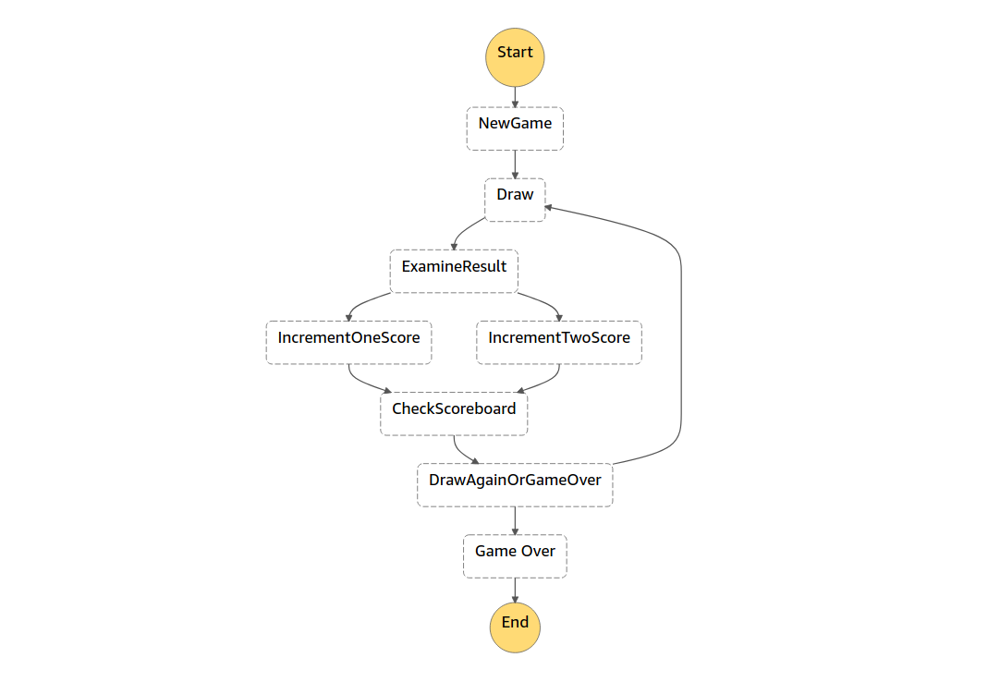

# Step Functions Demo

This application demonstrates AWS Step Functions with a simple lucky number draw. A lambda function draws random numbers and contestants are awarded points when their number is drawn. When a contestant scores their third point, they are declared the winner.

## Use

[Install CDK](https://docs.aws.amazon.com/cdk/latest/guide/getting_started.html) or update to the latest `1.x` version.

Run `npm install` to install the dependencies, followed by `npm run build` to build the application. Deploy the application with `cdk deploy`. 

Open the AWS Management Console and find the deployed step function in the AWS Step Functions service. Select "Start Execution" and use the default input. The step function will begin running and its progress can be followed in the Visual Workflow pane.

The application will be deployed by CDK using your `default` profile and associated region. The `--profile` flag can be used to deploy with a non-default profile. For more information on profiles and regions, please refer to [Configuring the AWS CLI](https://docs.aws.amazon.com/cli/latest/userguide/cli-chap-configure.html).

## Architecture

The step function is comprised of a DynamoDB table and several lambda functions. The state machine looks like:

### Score table

The DynamoDB table stores the score for contestants `one` and `two`. The partition key is `contestant` and an attribute `wins` is added on the first run.

### NewGame Task State

A lambda function resets the scores for both contestants to zero or creates the contestants and sets their `wins` attribute to zero.

### Draw Task State

A lambda function draws random numbers. 

The lambda function models a flaky service that produces inconsistent results and polls until it produces a good result. Despite its best efforts, the lambda often times out before a good result is produced.

The function draws a random number between 1 and 6. If a 1 or 2 are drawn, the lambda succeeds and returns its result. Otherwise it tries again after one second. The lambda function times out after three seconds, which limits the number of draws to two.

On a timeout failure, the step function will retry the task two times after a brief interval. Two retries is enough to produce a good result most of the time. To demonstrate a failure case, the number of retries can be reduced to one.

### Examine Result Choice State

A Choice state examines the result passed from Draw. If the result is `1`, the next state is IncrementOneScore. If the result is `2`, the next state is IncrementTwoScore.

A default case could be added to this Choice state. What would happen if the result of Draw was not a `1` or a `2`? The Draw function code might be poorly written or maliciously altered.

### IncrementOneScore Task State

A lambda function increments `one`'s score in the Score table.

### IncrementTwoScore Task State

A lambda function increments `two`'s score in the Score table.

### CheckScoreboard Task State

A lambda checks the scoreboard to see if the last draw gave the winner a third victory. A overall winner or `null` is passed to the DrawAgainOrGameOver state.

### DrawAgainOrGameOver Choice State

A Choice state examines the result of the last scoreboard check. If an overall winner has been declared, the next state is GameOver. Otherwise, the next state is Draw and the next round begins.

### GameOver Pass State

Passes the winner to End.

## Useful CDK commands

The following commands are provided with the blank CDK template and can be used when inspecting or altering the application.

 * `npm run build`   compile typescript to js
 * `npm run watch`   watch for changes and compile
 * `npm run test`    perform the jest unit tests
 * `cdk deploy`      deploy this stack to your default AWS account/region
 * `cdk diff`        compare deployed stack with current state
 * `cdk synth`       emits the synthesized CloudFormation template